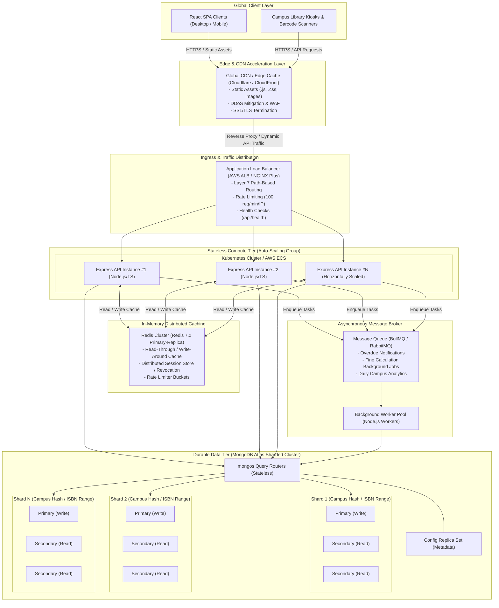
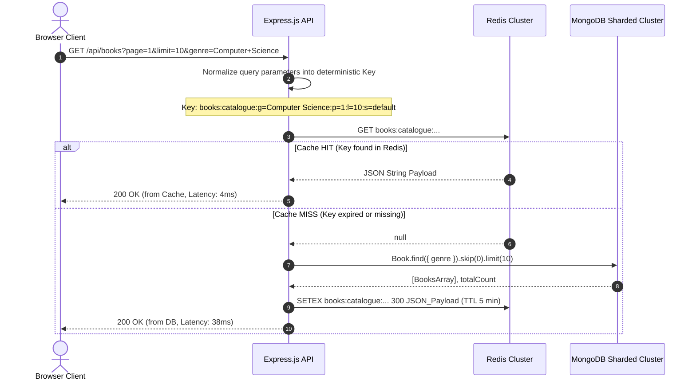
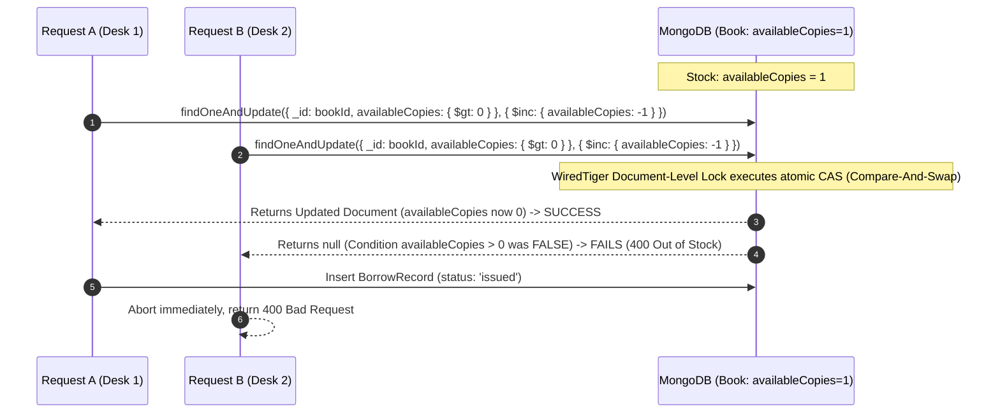
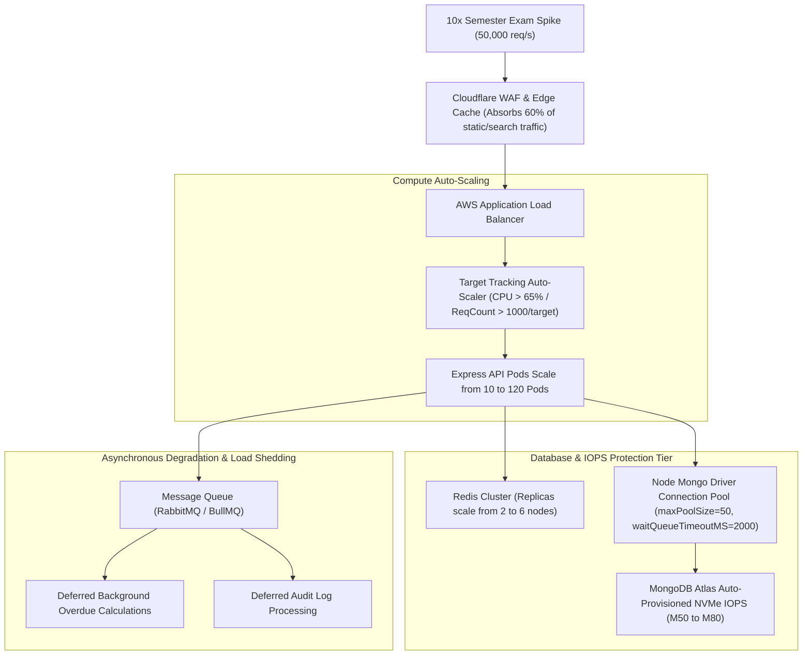

# ShelfLife — System Design & Scalability Architecture

**Course / Assessment**: Information Assurance 2 (IA2) — Full Stack Exam  
**Module**: Section C — System Design (10 Marks)  
**System**: ShelfLife Multi-Campus College Library Management System  

---

## Executive Summary & Target Scale

The ShelfLife library platform is designed to scale from a single-institution application to an enterprise multi-campus academic infrastructure supporting:
- **500 affiliated college campuses**
- **2,000,000 active student & faculty members**
- **10,000,000 catalogued book titles and physical volumes**
- **Peak concurrency**: ~50,000 concurrent HTTP requests during registration/semester exam weeks
- **SLA Requirements**: 99.95% availability, p99 read latency < 40ms, p99 transaction latency < 120ms

---

## Q3(a): High-Level System Architecture Diagram (500 Campuses, 2M Members)

The architecture decouples static content delivery, compute workloads, stateful caching, and durable multi-region storage.



### Architectural Component Breakdown:
1. **Edge CDN (CloudFront / Cloudflare)**:
   - Caches the built Vite React bundle, index.html, static assets, and logos with 30-day immutable cache-control headers.
   - Terminates TLS 1.3 at edge locations closest to the campus, shaving 60–100ms off round-trip times.
2. **Layer 7 Application Load Balancer (ALB)**:
   - Distributes API requests across active Node.js instances using least-outstanding-requests routing.
   - Enforces IP-based rate limiting to prevent scrape spam or credential stuffing on `/api/auth/login`.
3. **Stateless Express Compute Tier**:
   - Containerized Express.js containers running on Kubernetes (EKS) or AWS ECS.
   - Stateless design enables instant autoscaling from 10 instances during off-hours to 120+ instances during examination peaks.
4. **Redis In-Memory Distributed Cluster**:
   - Multi-node Redis cluster with master-replica replication and Sentinel automatic failover.
   - Absorbs ~85% of repeated catalogue search and genre filtering queries.
5. **MongoDB Sharded Cluster**:
   - Configured with `mongos` query routers, a 3-member config server replica set, and multiple underlying shards with primary/secondary replication for zero-downtime failover.

---

## Q3(b): Redis Caching Strategy for `GET /api/books`

Catalogue browsing and searching represents **80–90% of total system read traffic**. Uncached queries would saturate MongoDB query routers.



### 1. Cache Key Formulation
Cache keys must be deterministic and normalized regardless of query string parameter order:
```text
books:catalogue:g=<genre_normalized>:p=<page>:l=<limit>:s=<search_hash>
books:detail:id=<book_id>
books:genres:all
```
*Example*: `books:catalogue:g=Computer+Science:p=1:l=10:s=algorithms`

### 2. TTL (Time-To-Live) Strategy
- **Standard Catalogue Queries**: TTL = **300 seconds (5 minutes)**. Gives high cache hit ratios while bounding staleness.
- **Genre List (`books:genres:all`)**: TTL = **3600 seconds (1 hour)** since academic genres rarely change.
- **Book Detail (`books:detail:id=<id>`)**: TTL = **120 seconds (2 minutes)**.

### 3. Cache Invalidation Triggers
A write-around cache invalidation pattern is employed to guarantee consistency:
1. **Book Creation (`POST /api/books`)**:
   - Executes `Book.create(...)` in MongoDB.
   - Invalidates pattern `books:catalogue:*` and `books:genres:all` using Redis `UNLINK` or scan-delete helper.
2. **Book Issue / Checkout (`POST /api/borrow`)**:
   - The book's `availableCopies` changes.
   - Deletes `books:detail:id=<bookId>`.
   - Rather than purging the entire global catalogue cache on every issue, catalogue records store stock tiers or invalidates the affected genre key: `books:catalogue:g=<genre>:*`.
3. **Book Return (`POST /api/return/:borrowId`)**:
   - Restores available copy count.
   - Deletes `books:detail:id=<bookId>` and invalidates associated genre cache slice.

### 4. Cache Stampede (Thundering Herd) Prevention
When a hot cache key expires during peak examination hours, thousands of concurrent requests could miss simultaneously and crash the database. We prevent this using two techniques:

#### A. Mutex Lock via Redis `SET NX EX`
```typescript
async function getBooksWithMutex(cacheKey: string, queryFn: () => Promise<any>): Promise<any> {
  const cached = await redis.get(cacheKey);
  if (cached) return JSON.parse(cached);

  const lockKey = `lock:${cacheKey}`;
  const acquiredLock = await redis.set(lockKey, 'locked', 'EX', 5, 'NX');

  if (acquiredLock) {
    try {
      const freshData = await queryFn();
      // Jitter TTL (270s - 330s) to prevent synchronized mass expiration
      const jitterTtl = 300 + Math.floor(Math.random() * 60) - 30;
      await redis.setex(cacheKey, jitterTtl, JSON.stringify(freshData));
      return freshData;
    } finally {
      await redis.del(lockKey);
    }
  } else {
    // Wait 50ms and retry from cache
    await new Promise((resolve) => setTimeout(resolve, 50));
    return getBooksWithMutex(cacheKey, queryFn);
  }
}
```

#### B. Probabilistic Early Expiration (XFetch Algorithm)
Express instances compute `delta * beta * ln(random())`: if the computed threshold exceeds remaining TTL, background revalidation triggers asynchronously before the key expires for other clients.

---

## Q3(c): Database Scaling & Sharding Strategy (MongoDB)

With 2,000,000 members and 10,000,000 books, a single MongoDB replica set would experience severe RAM saturation (working set exceeding WiredTiger cache) and write IOPS limits.

### 1. Books Collection Sharding
- **Estimated Document Size**: ~500 bytes.
- **Estimated Collection Size**: 10,000,000 books = ~5.0 GB raw data + 1.2 GB indexes.
- **Query Patterns**:
  - `GET /api/books?genre=...&search=...` (Browsing & Search)
  - `GET /api/books/:id` (Direct lookup during Issue & Return)
  - `Book.findOne({ ISBN })` (Uniqueness check during creation)

#### Optimal Shard Key Selection: Hashed Compound Key `{ ISBN: "hashed" }` or Range `{ genre: 1, _id: 1 }`
- **Recommended Shard Key**: **`{ ISBN: "hashed" }`**
- **Justification**:
  - **Even Write & Read Distribution**: ISBN numbers follow industry distribution patterns. Hashing the ISBN guarantees uniform chunk distribution across all shards, eliminating write hotspots.
  - **Scatter-Gather Trade-off Mitigation**: While genre searches query multiple shards, the Redis caching layer absorbs 85%+ of genre queries. Primary transaction workloads (looking up book availability by ISBN or ID) are targeted or single-shard routed.
  - **Anti-Pattern Warning**: Sharding by monotonically increasing `createdAt` or `_id: 1` would cause all new book inserts to hit the same shard (the "hot shard" problem).

### 2. BorrowRecords Collection Sharding
- **Estimated Volume**: 2M members × average 15 transactions/year = **30,000,000 records/year** (~18 GB/year).
- **Query Patterns**:
  - `GET /api/members/:id/history` (Frequently queried by member or librarian)
  - `POST /api/borrow` (Insert new record for specific member)
  - `POST /api/return/:borrowId` (Update existing record)
  - Cron scan: `find({ status: 'issued', dueDate: { $lt: now } })` (Overdue sweeps)

#### Optimal Shard Key Selection: **`{ member: "hashed" }`**
- **Justification**:
  - **Co-location of Member Records**: All borrow transactions for a given student or faculty member reside on the exact same shard.
  - **Targeted History Queries**: When `GET /api/members/:id/history` executes, the `mongos` router directs the query to **one single shard** instead of scattering across the entire cluster.
  - **High Write Parallelism**: Since member IDs are randomly distributed across the campus population, concurrent checkout operations across 500 campuses distribute evenly across all shards.

---

## Q3(d): Concurrency Control for Issue-Book Operations

### The Race Condition Problem
If two librarians at different campus desks attempt to issue the last remaining copy (`availableCopies: 1`) of a popular textbook simultaneously:
1. Request A reads `availableCopies = 1`.
2. Request B reads `availableCopies = 1`.
3. Request A decrements in JavaScript (`1 - 1 = 0`) and saves.
4. Request B decrements in JavaScript (`1 - 1 = 0`) and saves.
5. **Result: 2 students are issued the same physical copy, inventory becomes corrupted (`availableCopies: -1`), violating library invariants.**



### 1. Production Implementation: Atomic Conditional Update (Implemented in ShelfLife)
Rather than reading and updating in separate steps, MongoDB executes an atomic compare-and-swap (CAS) operation at the WiredTiger storage engine level:

```typescript
// Atomically decrement ONLY IF availableCopies > 0
const updatedBook = await Book.findOneAndUpdate(
  {
    _id: bookId,
    availableCopies: { $gt: 0 }, // Atomic precondition
  },
  {
    $inc: { availableCopies: -1 }, // Atomic decrement
  },
  {
    new: true,
    runValidators: true,
  }
);

if (!updatedBook) {
  throw new AppError(
    'This book is currently out of stock or does not have available copies to issue.',
    400
  );
}

try {
  // Create BorrowRecord
  const borrowRecord = await BorrowRecord.create({
    book: bookId,
    member: memberId,
    dueDate,
    status: 'issued',
  });
  return borrowRecord;
} catch (error) {
  // Compensating transaction in case record creation fails
  await Book.findByIdAndUpdate(bookId, { $inc: { availableCopies: 1 } });
  throw error;
}
```

### 2. Comparison with Alternative Concurrency Strategies

| Strategy | Performance | Complexity | Fault Tolerance | Evaluation for ShelfLife |
| :--- | :--- | :--- | :--- | :--- |
| **Atomic Conditional Update** *(Chosen)* | **Ultra-Fast (< 5ms)** | **Low** | **High** (Native DB atomicity, zero network locks) | **Best Choice**: Directly exploits WiredTiger document-level locking without external dependencies. |
| **Distributed Lock (Redis Redlock)** | Moderate (15–30ms) | High | Fragile (Split-brain, clock drift risks) | Overkill for single-resource inventory; introduces Redis as a single point of transaction failure. |
| **Two-Phase Commit (2PC) / Multi-Doc Txn** | Slow (40–100ms) | Very High | Heavy abort rate under high contention | Valid if issuing multi-book bundles in a single transaction, but excessive for individual checkouts. |
| **Pessimistic DB Row Locking (`SELECT FOR UPDATE`)** | Slow | Moderate | Deadlock hazard | Renders the entire document blocked to reads while locked; not natively supported in MongoDB. |

---

## Q3(e): Handling 10× Traffic Spikes During Semester Examination Weeks

During the 2 weeks before semester exams, library circulation and search requests spike by **1000% (10×)**:
- **Search & Catalogue Queries**: 50,000 req/sec
- **Borrow / Issue Requests**: 5,000 req/sec
- **Due Date Return Surges**: 8,000 req/sec



### 1. Horizontal Auto-Scaling Policies
- **Metric Triggers**:
  - CPU Utilization > 65% sustained for 90 seconds.
  - ALB Request Count Per Target > 1,200 req/min.
- **Scale-Out Pace**: Fast scale-out (`stepScaling` adding 20 pods per increment, zero cooldown) to absorb instant morning exam spikes.
- **Scale-In Dampening**: 15-minute cooldown period to prevent thrashing during lunch lulls.

### 2. Read Replica Scaling & Secondary Read Preference
- For non-transactional read endpoints (`GET /api/books`, `GET /api/books/genres`), Express clients configure Mongoose read preference:
  ```typescript
  mongoose.connect(MONGO_URI, {
    readPreference: 'secondaryPreferred',
  });
  ```
- Scale MongoDB secondary nodes from 2 replicas per shard to 5 read replicas per shard. 80% of read traffic is served by read replicas, keeping primary nodes 100% dedicated to atomic write transactions.

### 3. Queue-Based Load Shedding (BullMQ / RabbitMQ)
Non-critical operations are stripped from synchronous HTTP request/response paths:
- **Notification Emails**: Confirmation receipts, due date reminder emails, and fine calculations are enqueued into RabbitMQ and processed asynchronously by worker pools during off-peak hours (11 PM – 5 AM).
- **Audit Logging**: Request telemetry and librarian audit trails are streamed to Amazon Kinesis / Apache Kafka rather than executing synchronous database inserts.

### 4. Database Connection Pooling & Circuit Breaking
- **Connection Sizing Equation**:
  $$\text{maxPoolSize} = \left(\frac{\text{Concurrent Pods} \times 20}{\text{Primary Core Count}}\right)$$
  Configured to `maxPoolSize: 50` per Express container to avoid exhausting MongoDB file descriptors.
- **Wait Queue Timeout**: `waitQueueTimeoutMS: 2500`. If database connections are queued for more than 2.5s, requests fail fast with HTTP 503 rather than holding server sockets open.
- **Circuit Breakers (opossum / Polly)**: If Redis or MongoDB error rate exceeds 20% over a 10-second window, the circuit trips to **Open**, immediately serving cached fallback catalogues or polite queue wait screens.

### 5. Graceful Degradation (Degraded Mode)
If traffic exceeds 15× absolute capacity:
1. **Tier 1 (Non-Essential)**: Book cover thumbnail generation and fuzzy search autocomplete are disabled.
2. **Tier 2 (Catalogue Fallback)**: `GET /api/books` serves stale cache from Redis with `Warning: 110 Response is Stale` headers.
3. **Tier 3 (Core Preservation)**: Book issuing (`POST /api/borrow`) and returns (`POST /api/return`) remain strictly protected with guaranteed consistency.
