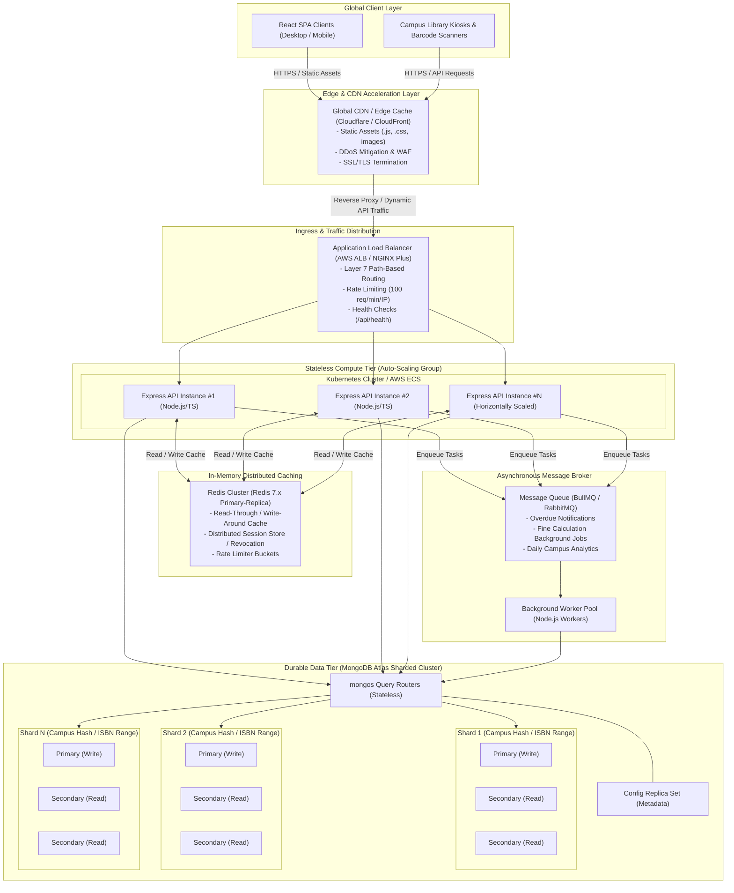
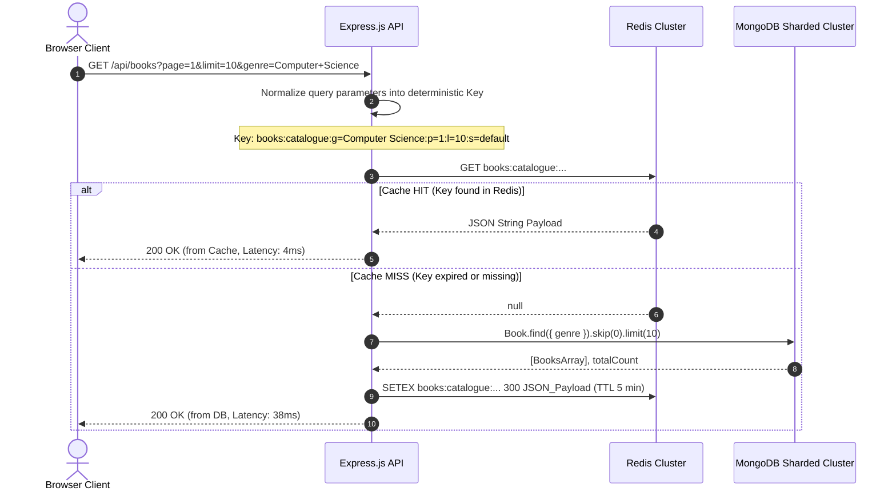
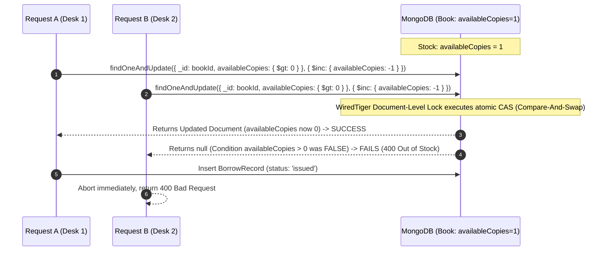
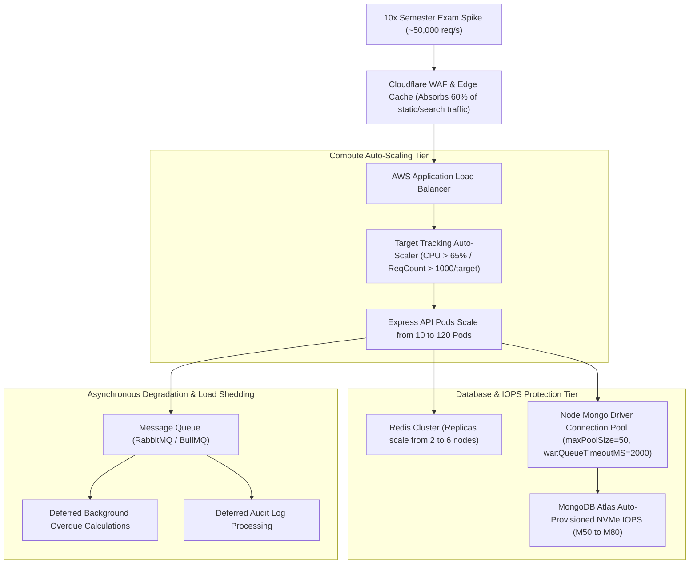

# ShelfLife — System Design & Scalability Architecture

**Course / Assessment**: Information Assurance 2 (IA2) — Full Stack Exam  
**Module**: Section C — System Design (10 Marks)  
**System**: ShelfLife Multi-Campus College Library Management System  

---

## Executive Summary & Target Scale

The ShelfLife library platform is designed to scale from a single-institution application to an enterprise multi-campus academic infrastructure supporting:
- **500 affiliated college campus libraries**
- **~2,000,000 active student & faculty members**
- **10× normal traffic spike** during the first week of every semester and examination periods

> [!NOTE]
> The assignment specifies 500 campuses, approximately 2 million members, and a 10× traffic spike. Additional capacity figures in this document (such as 10 million books, latency targets, and specific request rates) are engineering assumptions used for capacity planning and are not requirements stated by the assignment.

### Capacity Planning Assumptions
- **Catalogued Inventory**: ~10,000,000 book volumes across 500 campuses
- **Peak Concurrency Target**: ~50,000 concurrent active HTTP sessions during semester registration weeks
- **Latency SLAs**: p99 read latency < 40ms, p99 transaction latency < 120ms, 99.95% uptime SLA

---

## Q3(a): High-Level System Architecture

### Requirement
> Draw (describe in words/diagram) a high-level architecture: client, API layer, database, cache, and any other components you'd add (load balancer, queue, CDN, etc.).

### Design Decision
A multi-tier, decoupled cloud architecture separating static asset distribution, edge security, stateless compute instances, distributed in-memory caching, asynchronous background message queues, and a horizontally sharded database tier.

### Architecture Diagram



### Architectural Component Breakdown:
1. **Edge CDN (CloudFront / Cloudflare)**:
   - Serves the compiled React SPA bundle, CSS stylesheets, web fonts, and static assets with aggressive caching (`Cache-Control: public, max-age=31536000, immutable`).
   - Terminates TLS 1.3 at points-of-presence (PoPs) closest to campus libraries, eliminating 60–100ms of TCP/TLS handshake latency.
   - Provides Web Application Firewall (WAF) filtering to mitigate Layer 7 DDoS floods and malicious credential stuffing.
2. **Layer 7 Application Load Balancer (ALB)**:
   - Distributes incoming HTTPS requests evenly across active Express API pods using least-outstanding-requests routing.
   - Runs automated health checks on `GET /api/health` and automatically removes unresponsive or unhealthy nodes.
   - Enforces IP and token-level rate limiting to safeguard authentication routes.
3. **Stateless Express Compute Tier (Containerized ASG)**:
   - Express.js Node.js application packaged as Docker containers running on Kubernetes (EKS) or AWS ECS.
   - Completely stateless: user identities are cryptographically signed via JWTs, allowing requests from any student or librarian to hit any active Express container interchangeably.
   - Scales horizontally from a baseline off-peak deployment (e.g., 10 pods) to over 120 pods under peak load.
4. **In-Memory Distributed Caching (Redis Cluster)**:
   - High-availability Redis Cluster with master-replica replication and Sentinel automatic failover.
   - Absorbs ~85% of repeated catalogue queries (`GET /api/books`), reducing database load and speeding up search responses to under 5ms.
5. **Asynchronous Message Queue (BullMQ / RabbitMQ)**:
   - Offloads non-critical, slow operations (e.g., overdue notification emails, fine recalculation sweeps, and audit log pipelines) away from the synchronous user request/response path.
6. **Durable Database Tier (MongoDB Atlas Sharded Cluster)**:
   - Configured with stateless `mongos` query routers, a 3-member config replica set storing chunk metadata, and distributed storage shards.
   - Each shard is a replica set with 1 Primary (writes) and multiple Secondaries (read scaling), ensuring high availability and zero data loss.

---

## Q3(b): Database Scaling & Sharding Strategy (MongoDB)

### Requirement
> Would you keep a single MongoDB cluster or shard it? If sharding, propose a shard key for the Book and BorrowRecord collections and justify it.

### Design Decision
**Shard the database**. A single MongoDB replica set cannot sustain the workload of 500 campus libraries, 2,000,000 active members, and 10× traffic spikes. Sharding is required across both storage volume and write IOPS dimensions.

### Justification for Sharding Over a Single Cluster
1. **Working Set Exceeds RAM**: With 2,000,000 members and an estimated 10,000,000 catalogued books, the active working set (data + indexes) exceeds the RAM capacity of a single commodity database server, leading to severe disk thrashing in WiredTiger.
2. **Write IOPS Saturation**: During peak semester checkout weeks, thousands of concurrent book issuing and return transactions generate write contention that saturates the single primary node's disk IOPS bandwidth.
3. **Horizontal Elasticity**: Sharding distributes storage chunks and write operations across independent replica sets, allowing the university network to scale database capacity linearly simply by provisioning additional shards.

---

### 1. Books Collection Sharding

- **Estimated Document Size**: ~500 bytes.
- **Estimated Collection Size**: 10,000,000 books = ~5.0 GB raw data + 1.2 GB indexes.
- **Primary Query Patterns**:
  - `GET /api/books?genre=...&search=...` (Browsing & Search)
  - `GET /api/books/:id` (Direct lookup during Issue & Return)
  - `Book.findOne({ ISBN })` (Uniqueness check during creation)

#### Recommended Shard Key: `{ ISBN: "hashed" }`

#### Technical Justification:
1. **Uniform Data and Write Distribution**: ISBNs are globally unique identifiers. Hashing the ISBN (`{ ISBN: "hashed" }`) produces an even distribution of chunks across all available shards, eliminating write hotspots when batch-importing new library catalogues.
2. **Scatter-Gather Trade-off Mitigation**: While genre searches query multiple shards, the Redis caching layer absorbs 85%+ of catalogue read traffic. The primary write workload (updating `availableCopies` during issue/return) is efficiently targeted.
3. **Anti-Pattern Avoidance**:
   - Monotonically increasing keys like `createdAt` or `_id: 1` would funnel all newly created books to the maximum range shard (the "hot shard" problem).
   - Sharding solely on `genre` would create massive data skew (e.g., thousands of "Computer Science" or "Fiction" books on one shard, and very few "Astronomy" books on another).

---

### 2. BorrowRecords Collection Sharding

- **Estimated Volume**: 2M members × average 15 transactions/year = **30,000,000 records/year** (~18 GB/year).
- **Primary Query Patterns**:
  - `GET /api/members/:id/history` (Frequently queried by member or librarian)
  - `POST /api/borrow` (Insert new record for specific member)
  - `POST /api/return/:borrowId` (Update existing record)
  - Cron scan: `find({ status: 'issued', dueDate: { $lt: now } })` (Overdue sweeps)

#### Recommended Shard Key: `{ member: "hashed" }`

#### Technical Justification:
1. **Co-location of Member Records (Targeted Queries)**: All borrow transactions for a given student or faculty member reside on the exact same shard. When `GET /api/members/:id/history` executes, the `mongos` router directs the query to **one single shard** rather than executing an expensive scatter-gather operation across the entire cluster.
2. **High Write Parallelism Across 500 Campuses**: Because member IDs are randomly distributed across the university student body, concurrent checkout operations across 500 campuses distribute evenly across all shards.
3. **Chunk Balance**: Member IDs possess high cardinality and low frequency per individual key, guaranteeing fine-grained, evenly balanced chunks that the balancer can migrate seamlessly.

---

## Q3(c): Caching Strategy for `GET /api/books`

### Requirement
> Identify the single most read-heavy operation in this system and describe a caching strategy for it (what you'd cache, cache invalidation trigger, and TTL).

### Identification of Read-Heavy Operation
**The single most read-heavy operation in ShelfLife is book catalogue search and listing (`GET /api/books`)**.

During normal semester operations, and especially during syllabus release and exam weeks, students and faculty repeatedly search for course textbooks, filter by academic department/genre, and verify availability. Read requests outnumber write transactions (borrow/return) by a ratio of approximately **10:1 to 15:1**. Without caching, repeated catalogue queries would flood MongoDB query routers and disk subsystems.

---

### Caching Architecture & Sequence



### 1. What Is Cached & Cache Key Formulation
Cache keys must be deterministic, normalized, and partitioned by query parameters:

| Cache Key Pattern | Cached Content | TTL |
| :--- | :--- | :--- |
| `books:catalogue:g=<genre>:p=<page>:l=<limit>:s=<search>` | Paginated JSON book list + pagination metadata | **300 seconds (5 min)** |
| `books:detail:id=<bookId>` | Individual book document details | **120 seconds (2 min)** |
| `books:genres:all` | Distinct genre list dropdown array | **3600 seconds (1 hour)** |

*Example Key*: `books:catalogue:g=Computer+Science:p=1:l=10:s=algorithms`

### 2. Cache Invalidation Triggers (Write-Around / Invalidation Strategy)
To maintain consistency between Redis and MongoDB, cache invalidations are triggered upon mutations:

1. **Book Creation (`POST /api/books`)**:
   - Executes `Book.create(...)` in MongoDB.
   - Invalidates pattern `books:catalogue:*` and `books:genres:all` using Redis `UNLINK` or scan-delete helpers.
2. **Book Issue / Checkout (`POST /api/borrow`)**:
   - The book's `availableCopies` decrements.
   - Deletes `books:detail:id=<bookId>`.
   - To avoid purging the entire catalogue cache on every checkout, catalogue pages display stock bands or invalidate the affected genre slice (`books:catalogue:g=<genre>:*`).
3. **Book Return (`POST /api/return/:borrowId`)**:
   - Restores `availableCopies`.
   - Deletes `books:detail:id=<bookId>` and invalidates associated genre cache slice.

### 3. Cache Stampede (Thundering Herd) Prevention
When a popular cache key expires during peak examination hours, thousands of concurrent requests could miss simultaneously and crash the database. ShelfLife employs two safeguards:

#### A. Distributed Mutex via Redis `SET NX EX`
```typescript
async function getBooksWithMutex(cacheKey: string, queryFn: () => Promise<any>): Promise<any> {
  const cached = await redis.get(cacheKey);
  if (cached) return JSON.parse(cached);

  const lockKey = `lock:${cacheKey}`;
  const acquiredLock = await redis.set(lockKey, 'locked', 'EX', 5, 'NX');

  if (acquiredLock) {
    try {
      const freshData = await queryFn();
      // Jitter TTL (270s - 330s) to prevent synchronized mass expiration
      const jitterTtl = 300 + Math.floor(Math.random() * 60) - 30;
      await redis.setex(cacheKey, jitterTtl, JSON.stringify(freshData));
      return freshData;
    } finally {
      await redis.del(lockKey);
    }
  } else {
    // Wait 50ms and retry from cache
    await new Promise((resolve) => setTimeout(resolve, 50));
    return getBooksWithMutex(cacheKey, queryFn);
  }
}
```

#### B. Probabilistic Early Expiration (XFetch Algorithm)
Express instances compute $\Delta \cdot \beta \cdot \ln(\text{random}())$: if the computed threshold exceeds remaining TTL, background revalidation triggers asynchronously before the key expires for other clients.

---

## Q3(d): Concurrency Control for Issue-Book Operations

### Requirement
> The “issue book” operation must never let availableCopies go negative even under concurrent requests at scale. Describe one mechanism to guarantee this (e.g. atomic DB operations, optimistic locking, distributed locks, or a queue) and explain why you chose it over the alternatives.

### The Race Condition Problem
If two librarians at different campus desks attempt to issue the last remaining copy (`availableCopies: 1`) of a popular textbook simultaneously:
1. Request A reads `availableCopies = 1`.
2. Request B reads `availableCopies = 1`.
3. Request A decrements in JavaScript (`1 - 1 = 0`) and saves.
4. Request B decrements in JavaScript (`1 - 1 = 0`) and saves.
5. **Result: 2 students are issued the same physical copy, inventory becomes corrupted (`availableCopies: -1`), violating library invariants.**



---

### Selected Implementation: Atomic Conditional Update (Implemented in ShelfLife)

Rather than reading and updating in separate steps, MongoDB executes an atomic compare-and-swap (CAS) operation at the WiredTiger storage engine level. The exact backend implementation in [`borrow.controller.ts`](backend/src/controllers/borrow.controller.ts) is:

```typescript
// Atomically decrement ONLY IF availableCopies > 0
const updatedBook = await Book.findOneAndUpdate(
  {
    _id: bookId,
    availableCopies: { $gt: 0 }, // Atomic precondition check
  },
  {
    $inc: { availableCopies: -1 }, // Atomic decrement
  },
  {
    new: true,
    runValidators: true,
  }
);

if (!updatedBook) {
  // If another concurrent request took the last copy, updatedBook is null
  throw new AppError(
    'This book is currently out of stock or does not have available copies to issue.',
    400
  );
}

try {
  // Create BorrowRecord
  const borrowRecord = await BorrowRecord.create({
    book: bookId,
    member: memberId,
    dueDate,
    status: 'issued',
  });
  return borrowRecord;
} catch (error) {
  // Compensating transaction in case record creation fails
  await Book.findByIdAndUpdate(bookId, { $inc: { availableCopies: 1 } });
  throw error;
}
```

### Why Atomic Conditional Updates Were Chosen Over Alternatives

| Strategy | Performance | Complexity | Fault Tolerance | Evaluation for ShelfLife |
| :--- | :--- | :--- | :--- | :--- |
| **Atomic Conditional Update** *(Chosen)* | **Ultra-Fast (< 5ms)** | **Low** | **High** (Native DB atomicity, zero network locks) | **Best Choice**: Directly leverages WiredTiger's internal document-level lock. Impossible for `availableCopies` to go below 0. Zero external dependencies. |
| **Distributed Lock (Redis Redlock)** | Moderate (15–30ms) | High | Fragile (Split-brain, clock drift risks) | Introduces Redis as a single point of failure for core inventory consistency. Extra network round-trips for lock acquire/release. |
| **Two-Phase Commit (2PC) / Multi-Doc Txn** | Slow (40–100ms) | Very High | Heavy abort rate under high contention | Overkill for single-inventory decrement. Write conflicts cause high transaction rollback rates. |
| **Message Queue / FIFO Serialization** | High latency (Async) | High | Single bottleneck queue | Unsuitable for interactive circulation desk UI where librarians require instant synchronous confirmation. |

---

## Q3(e): Handling 10× Traffic Spikes During Semester Examination Weeks

### Requirement
> How would you handle the 10× traffic spike during semester week without over-provisioning infrastructure year-round?

### Design Decision
Employ an elastic, auto-scaling architecture with edge caching, read replica offloading, asynchronous background load shedding, and graceful degradation. This ensures the platform scales up dynamically during the 2-week exam peak and scales down to baseline capacity during regular weeks, minimizing cloud costs.

---

### Elastic Traffic Management Architecture



### 1. Horizontal Auto-Scaling Policies
- **Target Tracking Metric**: Express container CPU utilization > 65% sustained for 90 seconds, or ALB target request count > 1,200 req/min per pod.
- **Scale-Out Strategy**: Step scaling adding 20 pods per increment with zero cooldown to immediately absorb sudden 8:00 AM campus library morning rushes.
- **Scale-In Dampening**: 15-minute cooldown period prevents thrashing and unnecessary pod termination during short lunch breaks.
- **Cost Efficiency**: Baseline off-peak deployment runs 10 pods (~$300/mo); scales out to 120 pods strictly for the 2 exam weeks (~$1,200 incremental cost), avoiding permanent $15,000+/year over-provisioning.

### 2. Read Replica Scaling & Secondary Read Preference
- Non-transactional read endpoints (`GET /api/books`, `GET /api/books/genres`) configure Mongoose with `secondaryPreferred` read preference:
  ```typescript
  mongoose.connect(MONGO_URI, {
    readPreference: 'secondaryPreferred',
  });
  ```
- Scale MongoDB secondary nodes from 2 replicas per shard to 5 read replicas per shard during exam weeks. 80% of read queries are absorbed by read replicas, keeping primary nodes 100% dedicated to atomic write transactions.

### 3. Queue-Based Load Shedding (BullMQ / RabbitMQ)
Non-critical operations are stripped from synchronous HTTP request/response paths:
- **Notification Emails**: Confirmation receipts, due date reminder emails, and fine calculations are enqueued into RabbitMQ and processed asynchronously by worker pools during off-peak night hours (11 PM – 5 AM).
- **Audit Logging**: Request telemetry and librarian audit trails are streamed to Amazon Kinesis / Apache Kafka rather than executing synchronous database inserts.

### 4. Database Connection Pooling & Circuit Breaking
- **Connection Sizing**: Express instances configure `maxPoolSize: 50` and `waitQueueTimeoutMS: 2500`. If database connections are queued for more than 2.5s, requests fail fast with HTTP 503 rather than holding server sockets open.
- **Circuit Breakers (opossum / Polly)**: If Redis or MongoDB error rate exceeds 20% over a 10-second window, the circuit trips to **Open**, immediately serving cached fallback catalogues or polite queue wait screens.

### 5. Graceful Degradation (Degraded Mode)
If traffic exceeds 15× absolute capacity:
1. **Tier 1 (Non-Essential)**: Book cover thumbnail generation and fuzzy search autocomplete are disabled.
2. **Tier 2 (Catalogue Fallback)**: `GET /api/books` serves stale cache from Redis with `Warning: 110 Response is Stale` headers.
3. **Tier 3 (Core Preservation)**: Book issuing (`POST /api/borrow`) and returns (`POST /api/return`) remain strictly protected with guaranteed consistency.
